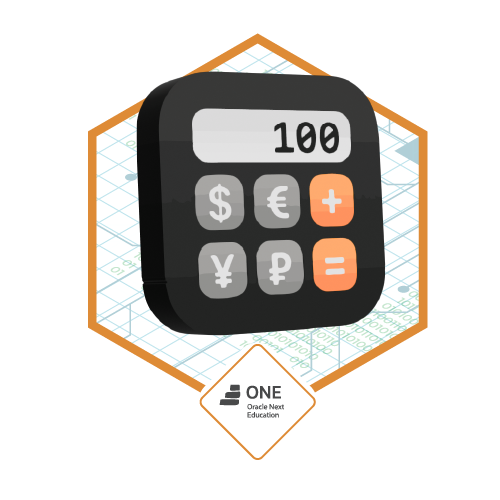
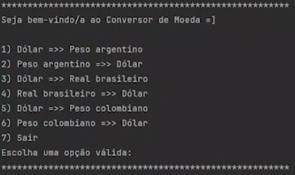
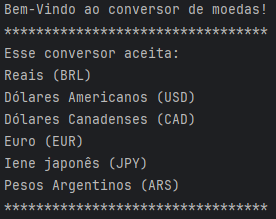
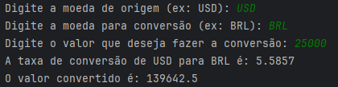
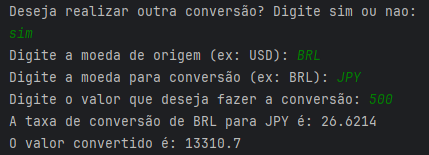
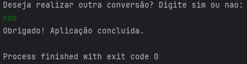

<h1 style="display: flex; align-items: center;">
    💱 Projeto Conversor de Moeda 💱
    
</h1>

---
#### 🚩 G7 ONE | Java e Orientação a Objetos | Java: Praticando Java : Challenge conversor de moedas 🚩
#### 🌎 [@Alura](https://www.alura.com.br/) | [@One](https://www.oracle.com/br/) 

*💵 Projeto Conversor de moedas proposto pela aulas do curso 💵*

---
### Pré-requisitos:
 - _Ter o java instalado em sua máquina, a partir do `Java 8`;_
 - Adicionar a biblioteca Gson em seu `Project Structure`, link para acesso (https://mvnrepository.com/artifact/com.google.code.gson/gson/2.10.1) versão 2.10.1;
 - API utilizada (https://www.exchangerate-api.com/);

---
### Objetivo do projeto:
 - _Desenvolver um Conversor de moedas que ofereça interação textual (via console) com os usuários;_
 - _Proporcionar no mínimo 6 opções distintas de conversão de moeda em um menu_;
 - _Cada moeda deve ter sua taxa de conversão obtida por meio de uma API;_

Exemplo de projeto:
> 

---
### Tela inicial:
- _Ao iniciar a apliação, será exibido ao usuário um menu com as moedas e suas respectivas siglas para a conversão._

> 

### Escolhendo a moeda:
- _O usuário deverá escolhar as opções que foram mostradas no menu e escolher entre, a moeda de `origem` e em seguida a moeda que irá desejar fazer a `conversão`._
- _Em seguida deverá escolher o valor com base na moeda de `origem`, que irá fazer a `conversão`._
- _Após inserir todas as informações pedidas, será retornado ao usuário a taxa de `conversão` entre as moedas escolhidas e o valor `convertido`._

> 

### Continuar conversão:
- _Após a primeira `conversão` ficará a escolha do usuário se ele deseja parar ou continuar a conversão com outras moedas._
- _Caso deseje continuar:_
> 

- _Caso deseje parar:_
> 
